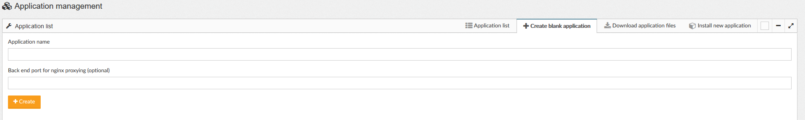
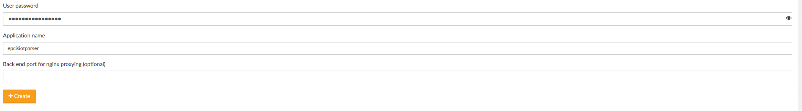

# EPCIS-IoT-Parser

This script parses the incoming data from IoT Sensor Nodes using [EPCIS-IoT-Arduino](https://github.com/iotfablab/EPCIS-IoT-Arduino) and adds the additional Meta-data as __Tags__ for InfluxDB.

## Hardware

- This script can be run on any hardware that supports EPCIS Information handling from RFID gates as well as an MQTT Broker.

- Currently the script is used on [Nordic ID AR82 RFID Reader](https://www.nordicid.com/wp-content/uploads/Nordic_ID_AR82_User_Guide_1v3.pdf)

## Usage on Nordic ID AR82

1. Login into the __Nordic ID AR82__ reader via it's IP address or mDNS address e.g. `arMACADDRESS.local`

2. On the __Nordic ID AR82__ create a new application (admin rights required) by clicking the Applications Icon

    

3. Create a Blank Application and name it `epcisiotparser`

    

   This should create a password which will be used later

    


4. Log into the reader via `ssh` and the application credentials:

        ssh -l epcisiotparser <IP_Address_of_AR82_Reader>
   
   Password should be one generated via the App.

5. Copy the contents of the `epcisiotparser/bin` folder to the present working directory on the reader.

        $ pwd # on reader
        /mnt/userdata/apps/epcisiot/bin

    Copy the `epcisiotreader/bin` to the reader using `scp`:

        $ # on your pc
        $ scp epcisiotparser/bin/* epcisiotparser@<AR82_IP_Address>:/mnt/userdata/apps/epcisiotparser/bin
    
    Copy the `epcisiotreader/properties` to respective directory on reader:

        $ scp epcisiotreader/properties/* epcisiotparser@<AR82_IP_Address>:/mnt/userdata/apps/epcisiotparser/properties

6. Install the Dependencies using: 
        
        pip install --user -r requirements.txt
    
    If installation fails, install them manually using:

        pip install --user toml \
                            pymongo \
                            influxdb \
                            paho-mqtt

7. Change the `config.toml` file with information about Document-Driven Database, Sensor Database (InfluxDB) and MQTT Broker

8. Check the MQTT Broker settings on the Reader by clicking on __Services__ in the Web App.

    

9. Change/Check the WLAN Access Point Settings in Networking Tab:

    

10. Start the Application from the Application List and Observe the Logs in System Logging Tab. Use the dropdown menu to find the logs of the app
    under `apps/epcisiotparser/epcisiotparser.log`


# Maintainer

* [Shantanoo Desai](https://github.com/shantanoo-desai)


# License

## Apache 2.0 License

```
Copyright 2019 BIBA-Bremer Institut für Produktion und Logistik GmbH, IoTFabLab

    Licensed under the Apache License, Version 2.0 (the "License");
    you may not use this file except in compliance with the License.
    You may obtain a copy of the License at

        http://www.apache.org/licenses/LICENSE-2.0
        
    Unless required by applicable law or agreed to in writing, software
    distributed under the License is distributed on an "AS IS" BASIS,
    WITHOUT WARRANTIES OR CONDITIONS OF ANY KIND, either express or implied.
    See the License for the specific language governing permissions and
    limitations under the License.
```